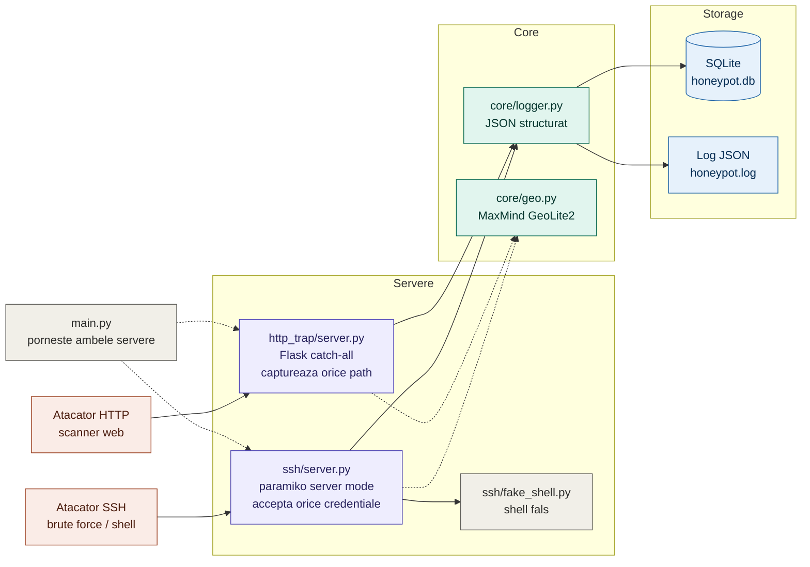

# SSH + HTTP Honeypot

A low-interaction honeypot that emulates an SSH server and an HTTP server
to capture real attack data: credentials attempted, commands typed, and
web paths scanned.

Deployed on a public VPS, it passively collects attack traffic from
automated bots and scanners — no interaction required. Data is stored in
SQLite for analysis and visualization.

---

## Architecture



For full technical documentation see [ARCHITECTURE.md](ARCHITECTURE.md).

---

## What it captures

**SSH** — for every connection attempt:
- Source IP and geolocation (country, city)
- Username and password tried
- Commands typed in the fake shell (if the attacker "logs in")

**HTTP** — for every request:
- Source IP and geolocation
- Method, path, User-Agent
- POST body (truncated to 500 chars) — catches credential stuffing attempts

---

## Design decisions

**Accept all SSH credentials** — the goal is to capture what attackers try,
not to block them. Every username/password pair goes to the database.

**Fake shell with plausible output** — keeps attackers connected longer,
capturing more commands. Responses to `whoami`, `uname -a`, `cat /etc/passwd`
look realistic without exposing the real system.

**Offline geolocation** — MaxMind GeoLite2 local database instead of an API:
no rate limits, no latency, works under heavy load.

**Structured JSON logging** — every event is written as a JSON line to
`honeypot.log`, ready to be ingested by a SIEM (Splunk, ELK) without
additional parsing.

**SQLite over flat files** — enables queries like "top 10 passwords tried"
or "all commands from IPs in Russia" without writing a parser.

---

## Installation

```bash
pip install -r requirements.txt
```

Download the MaxMind GeoLite2-City database (free, requires registration):
https://dev.maxmind.com/geoip/geolite2-free-geolocation-data

Place `GeoLite2-City.mmdb` in the `data/` directory.

---

## Usage

```bash
# local testing (no root required)
python3 main.py --ssh-port 2222 --http-port 8080

# production (on VPS, as root)
python3 main.py
```

---

## Sample output

```
[2024-11-14 08:22:01] ssh_attempt     185.224.128.43 [China]      root:123456
[2024-11-14 08:22:04] ssh_attempt     185.224.128.43 [China]      admin:admin
[2024-11-14 08:22:07] ssh_command     185.224.128.43 [China]      $ cat /etc/passwd
[2024-11-14 08:23:11] http_request    45.153.160.2 [Russia]       GET /.env
[2024-11-14 08:23:11] http_request    45.153.160.2 [Russia]       GET /wp-admin
```

---

## Deployment

See [DEPLOYMENT.md](DEPLOYMENT.md) for step-by-step instructions to run
this on a DigitalOcean VPS and collect real attack data.

---

## Limitations

- Low-interaction: the fake shell does not execute real commands.
  A determined attacker will notice, but automated bots won't.
- No HTTPS support (port 443) — planned.
- Analysis and visualization scripts are in progress.
