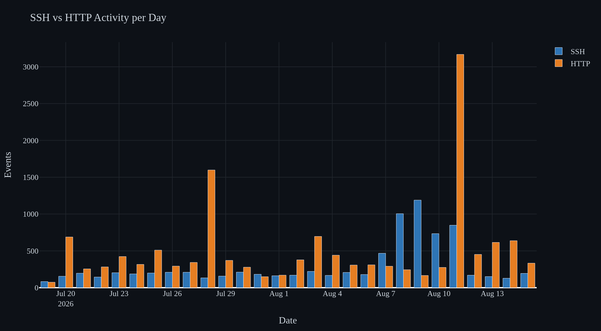
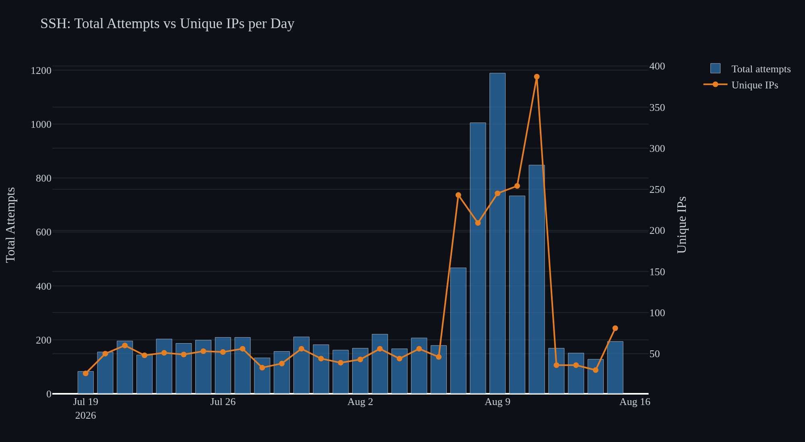
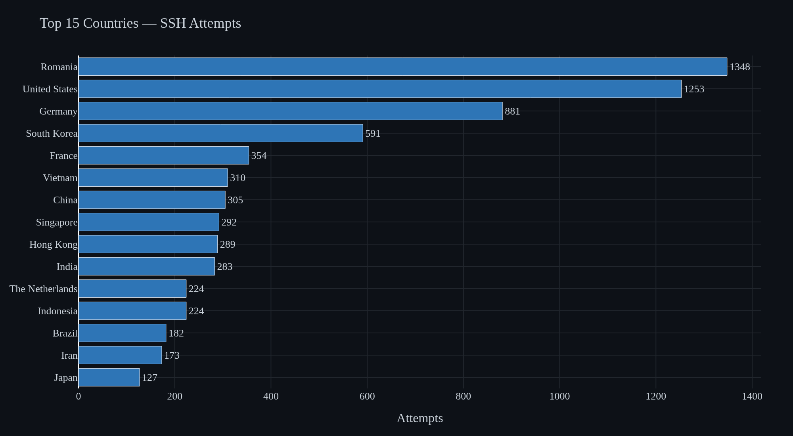
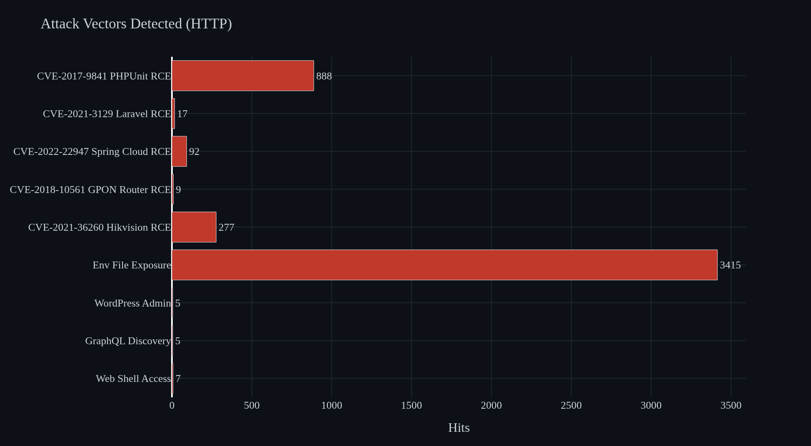
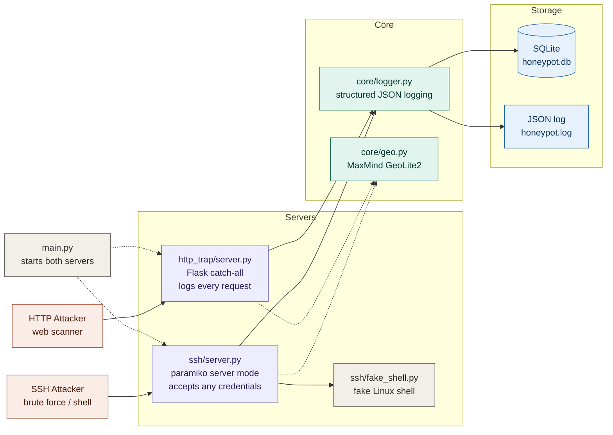

# SSH + HTTP Honeypot

A low-interaction honeypot that emulates an SSH server and an HTTP server
to capture real attack data: credentials attempted, commands typed, and
web paths scanned.

Deployed on a public VPS for 29 days, it passively collected attack traffic
from automated bots and scanners worldwide. Data is stored in SQLite for
analysis and visualization.

---

## Results - 29 Days of Real Attack Data

| Metric | Value |
|--------|-------|
| SSH credential attempts | **8,258** |
| HTTP requests captured | **14,064** |
| Unique attacker IPs | **1,641** |
| Countries of origin | **87** |
| Deployment period | July 19 – August 15, 2026 |

### Activity over time



SSH activity spiked significantly around day 20, when the VPS IP appeared
on additional scanning lists — unique attacker IPs jumped from ~50/day to
**240+ in a single day**, with total attempts reaching **1,000+/day** in the
final week.



### Geographic distribution



Romania appearing at the top reflects compromised VPS infrastructure used
as botnet intermediaries - not necessarily Romanian attackers.

### Attack vectors detected (HTTP)



| Hits | Attack Vector |
|------|--------------|
| 3,415 | Environment file (`.env`) exposure |
| 888 | CVE-2017-9841 — PHPUnit Remote Code Execution |
| 277 | CVE-2021-36260 — Hikvision IP Camera RCE |
| 92 | CVE-2022-22947 — Spring Cloud Gateway RCE |
| 17 | CVE-2021-3129 — Laravel Ignition RCE |
| 9 | CVE-2018-10561 — GPON Router RCE |

`.env` file exposure was by far the most targeted vector - attackers
scan for accidentally exposed environment files containing database
credentials and API keys.

Notable scanners identified by User-Agent: `Go-http-client/1.1`,
`CtfRceVerifyExpanded/1.0`, `libredtail-http`, `websiphon/0.1`, `zgrab`.

---

## Architecture


```mermaid
flowchart LR
    A1[SSH Attacker\nbrute force / shell]:::coral --> B1
    A2[HTTP Attacker\nweb scanner]:::coral --> B2

    subgraph srv [Servers]
        B1[ssh/server.py\nparamiko server mode\naccepts any credentials]:::purple
        B1 --> B3[ssh/fake_shell.py\nfake Linux shell]:::gray
        B2[http_trap/server.py\nFlask catch-all\nlogs every request]:::purple
    end

    subgraph core [Core]
        C1[core/logger.py\nstructured JSON logging]:::teal
        C2[core/geo.py\nMaxMind GeoLite2]:::teal
    end

    subgraph storage [Storage]
        D1[(SQLite\nhoneypot.db)]:::blue
        D2[JSON log\nhoneypot.log]:::blue
    end

    M[main.py\nstarts both servers]:::gray -.-> B1
    M -.-> B2

    B1 --> C1
    B2 --> C1
    B1 -.-> C2
    B2 -.-> C2
    C1 --> D1
    C1 --> D2

    classDef coral fill:#FAECE7,stroke:#993C1D,color:#4A1B0C
    classDef purple fill:#EEEDFE,stroke:#534AB7,color:#26215C
    classDef teal fill:#E1F5EE,stroke:#0F6E56,color:#04342C
    classDef blue fill:#E6F1FB,stroke:#185FA5,color:#042C53
    classDef gray fill:#F1EFE8,stroke:#5F5E5A,color:#2C2C2A
```

For full technical documentation see [ARCHITECTURE.md](ARCHITECTURE.md).

---

## What it captures

**SSH** - for every connection attempt:
- Source IP and geolocation (country, city)
- Username and password tried
- Commands typed in the fake shell after the attacker "logs in"

**HTTP** - for every request:
- Source IP and geolocation
- Method, path, User-Agent
- POST body (truncated to 500 chars) - catches credential stuffing and
  exploitation attempts

---

## Design decisions

**Accept all SSH credentials** - the goal is to capture what attackers try,
not to block them. Every username/password pair goes to the database.

**Fake shell with plausible output** - keeps attackers connected longer,
capturing more commands. Responses to `whoami`, `uname -a`, `cat /etc/passwd`
look realistic without exposing the real system.

**Offline geolocation** - MaxMind GeoLite2 local database instead of an API:
no rate limits, no latency, works under heavy load.

**Structured JSON logging** - every event is written as a JSON line to
`honeypot.log`, ready to be ingested by a SIEM (Splunk, ELK) without
additional parsing.

**SQLite over flat files** - enables queries like "top 10 passwords tried"
or "all commands from IPs in Russia" without writing a custom parser.

---

## Installation

```bash
pip install -r requirements.txt
```

Download the MaxMind GeoLite2-City database (free, requires registration):
https://dev.maxmind.com/geoip/geolite2-free-geolocation-data

Place `GeoLite2-City.mmdb` in the `data/` directory.

---

## Usage

```bash
# local testing (no root required)
python3 main.py --ssh-port 2222 --http-port 8080

# production (on VPS, as root)
python3 main.py
```

---

## Sample output

```
[2026-07-19 10:53:59] ssh_attempt     163.7.11.155 [China]        root:Qwer1234!@
[2026-07-19 10:54:03] ssh_attempt     185.242.3.195 [Netherlands] betty:123456
[2026-07-23 11:22:01] http_request    45.153.160.2 [Russia]       GET /.env
[2026-07-23 11:22:04] http_request    45.153.160.2 [Russia]       POST /vendor/phpunit/...
```

---

## Deployment

See [DEPLOYMENT.md](DEPLOYMENT.md) for step-by-step instructions to run
this on a DigitalOcean VPS and collect real attack data.

---

## Limitations

- Low-interaction: the fake shell does not execute real commands.
  A determined attacker will notice, but automated bots will not.
- No HTTPS support (port 443) — planned.
- Analysis script (`analysis/honeypot_analysis.py`) generates 14 charts
  from the collected SQLite database.
